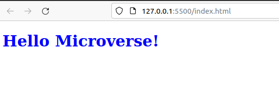

v

# Hello Micoverse!

> This is my first project at Micoverse. In it I include Linterns to check syntax errors, potencial problems and check the standard adherance of the code .

## Built With

- Html
- Css

## Live Demo

[Live Demo Link](https://livedemo.com)

## Authors

👤 **Edgar Esteban Muñoz Alba**

- GitHub: [@Estebanmual](https://github.com/Estebanmual)
- Twitter: [@Esteban_mual](https://twitter.com/Esteban_mual)
- LinkedIn: [Edgar Esteban Muñoz Alba](https://linkedin.com/in/estebanmual)

## 🤝 Contributing

Contributions, issues, and feature requests are welcome!

Feel free to check the [issues page](../../issues/).

## Show your support

Give a ⭐️ if you like this project!

## 📝 License

This project is [MIT](./MIT.md) licensed.
